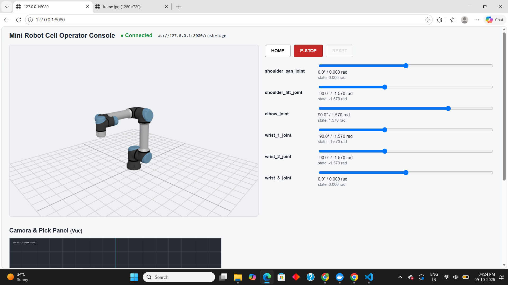
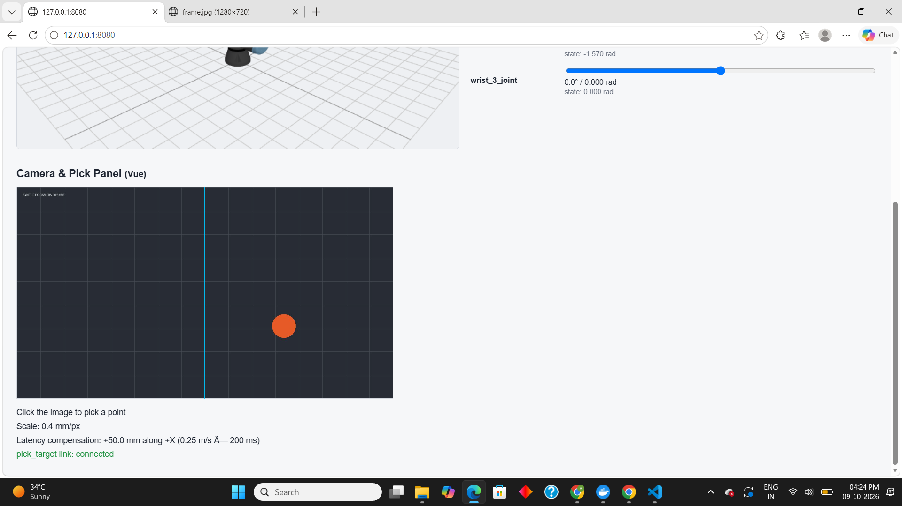

# Mini Robot Cell Operator Console

Browser-based operator console for a 6-axis UR5e arm and an overhead camera.
React main console + Vue camera/pick panel + ROS 2 backend, all in Docker.

## Run it

```bash
git clone https://github.com/vedikathorat08/mini-robot-cell.git
cd mini-robot-cell
docker compose up --build
```

Open **http://localhost:8080** (if `localhost` fails on Windows, use http://127.0.0.1:8080).

No other steps. Needs Docker with compose v2 only. Network is needed at **build time** only.

## Screenshots




Demo video: `docs/demo.mp4` (or link: https://drive.google.com/file/d/1xSpL94LgDsaTvph-AQZ3cCm7nric05yb/view?usp=sharing)

## Stack

- **ROS 2 Lyrical** (`ros:lyrical-ros-base` image, not desktop)
- **URDF:** UR5e from `ur_description` (BSD-3-Clause), expanded from xacro once by
  `scripts/extract_ur5e.sh` and committed with meshes and its package.xml in `backend/urdf/`.
  Credit: Universal Robots / ROS-Industrial `ur_description`.
- **Frontend:** React 18 + Three.js + urdf-loader (console), Vue 3 (camera panel), nginx.
- **Config:** everything tunable is in `config/cell.yaml`.

## What works

- One command build and run; no runtime downloads (all packages installed at build).
- 3D UR5e viewer posed **only** from `/joint_states` (UI -> `/joint_command` -> backend -> `/joint_states` -> UI).
- Six sliders with limits read from the URDF, shown in degrees and radians.
- Connection indicator with URL; auto-reconnects when the backend restarts.
- HOME, E-STOP and RESET. E-STOP is enforced in the backend (`joint_sim`), not only the UI.
- `/joint_states` at about 30 Hz (measured with `ros2 topic hz`).
- `robot_state_publisher` publishes the TF tree `base_link -> ... -> tool0`.
- Camera node: real webcam if `/dev/video0` opens, else a synthetic 1280x720 frame
  (moving blob, grid, timestamp). Never blocks or crashes startup.
- Vue panel: camera stream, crosshair, click -> pixel -> mm with display-vs-source scaling,
  latency compensation, and publishes `/pick_target`, which the backend logs.

## What doesn't work / known limits

- **Webcam on Windows / Docker Desktop is not passed through.** I only tested the
  synthetic fallback on my machine (Windows + Docker Desktop). The real-webcam path
  (`/dev/video0` via OpenCV) is untested on hardware.
- "Command becomes state immediately": no smoothing, so the arm snaps to the target.
- E-STOP state is held in the UI and re-sent every second while latched; the backend
  `joint_sim` keeps its own latch from the last `/estop` message. If the backend restarts
  while latched, it starts unlatched until the UI's next heartbeat (up to 1 s).
- Camera uses a plain MJPEG stream; no bandwidth adaptation.
- No automated tests (bonus not attempted).


## What I'd do next

- Smooth motion (max joint velocity) so the model animates.
- Unit tests for the pixel->mm and latency maths.
- Test the real webcam on a Linux host and add a camera-health indicator in the UI.
- Persist the E-STOP latch in the backend across restarts.

## Bonus items attempted

None. I chose to finish the core and document it honestly.

## Image size and build time

- Backend image: 3 GB Size (from `docker images | grep mini-robot-cell`)
- Frontend image: 29.9 MB
- Cold build time: about 3 minutes (2 min 50 s with `docker compose build --no-cache`; base images already pulled, my laptop and network).

## How to verify E-STOP and the no-camera fallback

**E-STOP (server side):**
1. Click E-STOP in the UI: red banner, sliders and HOME disabled.
2. Send a command from a terminal while latched:
```bash
   docker compose exec backend bash -c "source /opt/ros/lyrical/setup.bash && ros2 topic pub -w 1 -t 3 -r 2 /joint_command sensor_msgs/msg/JointState '{name: [shoulder_pan_joint], position: [1.0]}'"
   docker compose logs backend --tail 10 | grep -E "E-STOP|REJECTED"
```
   Expect `E-STOP LATCHED` and `REJECTED joint command: E-STOP is latched`.
3. Click RESET to clear.

**No camera:** on any machine without `/dev/video0` the stack logs one
`WARNING: /dev/video0 not found, using synthetic camera` and shows the synthetic frame.
To force it: set `NO_CAMERA=1` in the backend `environment:` in `docker-compose.yml`.

**Camera access (Linux):** `docker-compose.yml` bind-mounts `/dev` and sets
`device_cgroup_rules: ["c 81:* rmw"]` instead of listing `/dev/video0` under `devices:`,
so a missing device cannot stop the container from being created.

## Repo layout

```
docker-compose.yml     single entry point
config/cell.yaml       all tunables
backend/               Dockerfile, launch/, nodes/ (joint_sim, camera_node, pick_target_logger), urdf/
frontend/              Dockerfile (multi-stage), nginx.conf, react-app/, vue-panel/
scripts/               one-time URDF extraction helper (not run by the reviewer)
docs/                  screenshots, demo video
```
